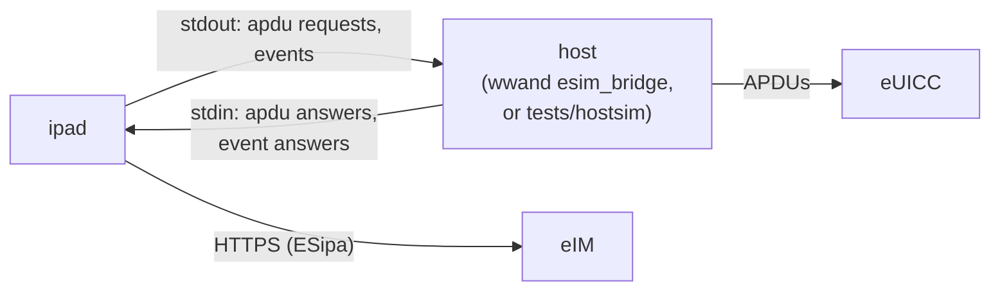
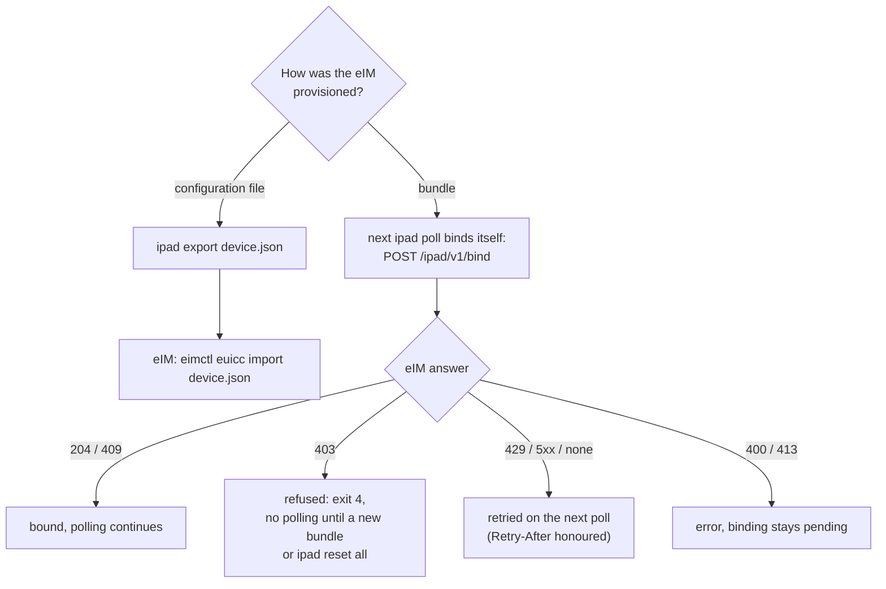

# ipad how-to

Using `ipad` on its own: building it, trying it against a simulated card,
provisioning an eIM, exporting the device key and reading what it reports.
For a router running wwand, the day-to-day steps are in wwand-ipa's
[how-to](https://github.com/ddimension/wwand-ipa/blob/main/docs/howto.md).
How the emulation of an SGP.22 card works is described in
[sgp22-emulation.md](sgp22-emulation.md).

Everything below was checked against `src/main.c`, `src/host.h` and
`tests/test_cli.sh`.

- [Build and test](#build-and-test)
- [How ipad reaches a card](#how-ipad-reaches-a-card)
- [Try it with the simulated card](#try-it-with-the-simulated-card)
- [Commands and options](#commands-and-options)
- [Provision an eIM](#provision-an-eim)
- [Register the device key at the eIM](#register-the-device-key-at-the-eim)
- [Poll](#poll)
- [What ipad reports](#what-ipad-reports)
- [Recover from a lost device key](#recover-from-a-lost-device-key)
- [Troubleshooting](#troubleshooting)

## Build and test

```sh
tools/fetch-mbedtls.sh            # mbedTLS 3.6.7 LTS, checksum-verified
cmake -S . -B build && cmake --build build
(cd build && ctest)               # unit + procedure tests, and `cli`
tools/esipa-check.sh              # every ESipa message against the eIM's ASN.1 types
tools/e2e-eim.sh ../../eim        # end to end against a real eIM (needs its postgres)
```

The binary is `build/ipad`. With testing enabled (CTest's default) the build
also produces `build/hostsim`, a stand-in host with a simulated SGP.22 card.
On OpenWrt the feed builds ipad as the package `wwand-ipad`, installed as
`/usr/lib/wwand/ipad`.

## How ipad reaches a card

ipad never opens a modem or a card reader. Every APDU goes to its **host** as
one JSON line on stdout, and the answer comes back on stdin. The protocol is
lpac's stdio APDU driver (lpac v2.3.0 `driver/apdu/stdio.c`), plus events for
the steps only the host can take (`src/host.h`):

| Event (ipad → host) | Host answers | Purpose |
|---|---|---|
| `profile_changed` `{iccid}` | `{"online":true\|false}` | make the modem use the new profile, and say whether the connection came back |
| `download` `{activation_code, confirmation_code}` (the code only when the eIM sent one) | `{"ok":true}` or `{"ok":false,"error":…}` | direct download through the host's ES9+ client, with the PIR left on the card |
| `connectivity` `{iccid, emulated, source, apn, username, password, pdp_type}` | `{}` | the enabled profile's connectivity parameters (5.9.24) |
| `info` `{eid, backend, key_fingerprint, bind, counter}` | `{}` | at the start of a run and for `info` |
| `summary` `{command, code, packages, acknowledged, downloads, notifications, changed, rolled_back, bind, error}` | `{}` | at the end of `poll` and `provision` |



wwand's `esim_bridge` is the host in production. It relays the APDUs over
the modem's QMI UIM, MBIM UICC or AT channel. `tests/hostsim` is the host for
trying things out. A host for a PC/SC reader or another modem stack has to
implement the protocol above, and no such host ships with ipad.

## Try it with the simulated card

`hostsim` runs one or more ipad commands in a row against **one** simulated
SGP.22 card (`tests/fake22.c`), so the state one command leaves behind is
there for the next:

```
hostsim [-o] [-a] [-E eid] [-P iccid[,iccid...]] -- ipad <args> [-- ipad <args> ...]
  -E  the card's EID (32 hex digits)
  -P  profiles on the card, the first enabled
  -o  answer profile_changed with online:false (to see a rollback)
  -a  refuse the download event
```

This is the sequence `tests/test_cli.sh` runs, using a throw-away state
directory:

```sh
cd build
# an EimConfigurationData: 30 { 80 id, 81 fqdn, 83 counter 0 }
printf '\060\041\200\017eim.cli.example\201\013127.0.0.1:9\203\001\000' >/tmp/cfg.der

./hostsim -- ./ipad -s /tmp/ipad-state poll \
          -- ./ipad -s /tmp/ipad-state provision /tmp/cfg.der \
          -- ./ipad -s /tmp/ipad-state info \
          -- ./ipad -s /tmp/ipad-state -i 353290611234567 export /tmp/dev.json
```

What comes out, in order:

1. `poll` before provisioning ends with `{"type":"lpa","payload":{"code":3,"message":"no eIM configured"}}`.
2. `provision` stores the configuration (`"code":0,"message":"provision"`).
3. `info` lists the eIM: `"eims":[{"id":"eim.cli.example",…}]`.
4. `export` writes `/tmp/dev.json` with `"format":"eim-euicc-import/1"` and
   `"device":{"imei":"353290611234567"}`.

`/tmp/ipad-state` now holds `device.key` and `<EID>.state`.

## Commands and options

```
ipad [options] poll | provision <file> | export <file> | connectivity | notify | info | reset
```

| Command | What it does |
|---|---|
| `poll` | Binds a provisioned bundle's card first (emulated cards). Then runs the eIM's packages until it has none (at most 16 per run), delivers pending notifications, and reports the enabled profile's connectivity parameters. |
| `provision <file>` | Stores an eIM configuration through `AddInitialEim`: DER or hex `EimConfigurationData` (`30…`), `AddInitialEimRequest` (`BF57…`, what `eimctl eim-config` writes) or `GetEimConfigurationDataResponse` (`BF55…`). An `eim-ipad-provision/1` bundle (first byte `{`) also sets the device key and is deleted once stored. |
| `export <file>` | Writes the `eim-euicc-import/1` file for the eIM. Emulated cards only. |
| `connectivity` | Reports the enabled profile's connectivity parameters only. |
| `notify` | Delivers pending notifications only. |
| `info` | EID, backend, device-key fingerprint, enabled ICCID, binding, counter and the configured eIMs, as one JSON line. |
| `reset <EID>` / `reset all` | `<EID>` (32 hex digits) deletes that card's `<EID>.state` and `<EID>.nbo` (the notification backoff) only; the device key, the `bind.*` markers and `<EID>.es9` stay, since the first two are shared by every card in the directory and the last describes notifications on the card. `all` deletes `device.key`, every `*.state` and `*.nbo`, and the `bind.*` markers. Without either it is refused (exit 2). No card is needed. `ipad -h` does not list it. |

| Option | Meaning |
|---|---|
| `-b auto\|iot\|emu` | card backend. `auto` (default) probes with `GetEimConfigurationData` |
| `-s <dir>` | state directory: emulation state and device key (default `/etc/wwand/ipa`) |
| `-e <eimId>` | the eIM to talk to (default: the first configured eIM with an FQDN) |
| `-u <url>` | eIM URL instead of `https://<eimFqdn>/gsma/rsp2/asn1` |
| `-c <file>` | CA bundle when the eIM configuration pins nothing (otherwise the system CAs, `/etc/ssl/certs/ca-certificates.crt`) |
| `-k` | do not verify the eIM's TLS certificate (testing only) |
| `-i <imei>` | device IMEI, 14–16 digits, for DeviceInfo (its first 8 digits are the TAC) and the import file |
| `-r <hex6>` | rPLMN, TS 24.008 coding, sent in `GetEimPackage` |
| `-C <n>` | send `notifyStateChange` with this cause on the next poll |
| `-D` | offer direct download: the host runs ES9+ (the `download` event) |
| `-F` | emulation: every profile may be the fallback. Not SGP.32, see [sgp22-emulation.md](sgp22-emulation.md#what-an-sgp22-card-lacks-and-what-ipad-does-instead) |
| `-v` | log to stderr too (ipad always logs to the syslog as `ipad`) |

Exit status:

| Code | Meaning |
|---|---|
| 0 | done |
| 1 | failed: eIM, network, card or file. The summary and the syslog say why. Also a binding still to be retried, and a bundle that is invalid or expired |
| 2 | usage error, or `provision` found no readable configuration or bundle in the file (a file that is a bundle but not a valid one is 1) |
| 3 | no eIM configured on the card or in the emulation: provision first |
| 4 | the eIM refused to bind this card (403). Polling stops until an operator acts |

## Provision an eIM

Pick one of the two routes, depending on what the eIM operator hands you.

**A configuration file** (`eimctl eim-config`, on the eIM side):

```sh
# eIM side
eimctl eim-config cfg.der --fqdn eim.example.com --counter 0
# device side
ipad -s /etc/wwand/ipa provision cfg.der
ipad -s /etc/wwand/ipa -i <IMEI> -D export device.json
```

- The configuration carries the eIM's signing key or certificate, its FQDN,
  the start counter and, optionally, the ESipa TLS trust anchor
  (`trustedPublicKeyDataTls`).
- A card that already has an eIM refuses a second `AddInitialEim`
  ("AddInitialEim refused: 2 (an eIM is already associated)"). Moving a card
  to another eIM is the eIM's business, through the `addEim` and `updateEim`
  eCOs.

**A bundle** (`eimctl ipad bundle`, eIM decision D-69):

```sh
ipad -s /etc/wwand/ipa provision ipad-<issuance>.json
```

- The bundle holds an **unencrypted private key**. Copy it only over a
  protected channel.
- ipad stores the configuration, replaces `device.key` with the bundle's key
  and deletes the file.
- A bundle that could not be stored is left in place and the error says why
  (expired, not RFC 3339, the card already has an eIM, …). Delete it or
  retry.
- For an IoT eUICC only the configuration is used.

## Register the device key at the eIM

Only for an **emulated** card. An IoT eUICC signs with its own certificate.



The import file and the binding are described in detail in
[sgp22-emulation.md](sgp22-emulation.md#how-the-eim-learns-the-device-key).

## Poll

```sh
ipad -s /etc/wwand/ipa -i <IMEI> -D poll
```

When the configuration pins no TLS anchor and the system CAs do not cover
the eIM, add `-c <ca.pem>`. `-k` is for a lab only.

A poll that switches the enabled profile sends the `profile_changed` event
and waits for the host's answer. With `hostsim -o` the answer is "offline",
and an enable that carried `rollbackFlag` is rolled back.

## What ipad reports

Each command ends with one result line on stdout:

```json
{"type":"lpa","payload":{"code":0,"message":"poll","data":"packages=2 acknowledged=1 downloads=0 notifications=3 changed=1 rolled_back=0"}}
```

`info` prints one line such as:

```json
{"type":"info","payload":{"eid":"89049032…","backend":"emulated","key_fingerprint":"3F2A…","iccid":"8949…","bind":"done","counter":7,"eims":[{"id":"eim.example.com","fqdn":"eim.example.com","tls":"certificate"}]}}
```

- `tls` says what the stored configuration carries as the eIM's TLS trust
  (`trustedPublicKeyDataTls`): `key` (a pinned key), `certificate` (the
  eIM's certificate or its CA), `system` (none: the CA bundle decides), or
  `configuration` (present, but neither a key nor a certificate). It is read
  from the configuration's structure only: a `key` or `certificate` that
  turns out unusable when connecting (a key too large, a certificate that
  does not parse) is logged then ("trustedPublicKeyDataTls unusable"), and
  the CA bundle decides instead.
- `key_fingerprint` is the SHA-256 of the device key's SubjectPublicKeyInfo,
  the same fingerprint the eIM audits.

The syslog (`logread -e ipad` on OpenWrt) carries ipad's own account of each
step, for example:

- "enabled profile … -> …"
- "profile rolled back to …"
- "ProfileRollback: 1; the result stays on the eUICC"
- "profile package loaded"
- "direct download done"
- "card bound at the eIM (204)"
- "notification … not delivered, kept" (the eIM was not reached)
- "notification … not taken by the eIM, kept; offered again in 3600s" (the
  backoff, `<EID>.nbo`, see
  [sgp22-emulation.md](sgp22-emulation.md#notifications-and-profile-installation-results))
- "InitiateAuthentication refused by the eIM: 52 (invalidEimTransactionId)",
  likewise AuthenticateClient and GetBoundProfilePackage with their ESipa
  error code and its name (SGP.32 5.14.1–5.14.3); "…: the eIM answered HTTP
  500 without the expected BF39" when there was no ESipa answer at all
- "eIM …: trustedPublicKeyDataTls unusable (…)"

## Recover from a lost device key

| Situation | What to do |
|---|---|
| `device.key` exists but cannot be read | ipad refuses to replace it ("device key … unreadable; not replacing it"). Fix the file (permissions, file system). Deleting it means re-keying on the eIM. |
| `device.key` is gone | The next run creates a new key. The eIM rejects results signed with it until it is re-keyed (below). |
| `<EID>.state` is gone, the key is not | The card has no eIM (`poll` exits 3). Provision a configuration whose counter is the eIM's current counter **N** for the card (`eimctl euicc show <EID>`), not N+1: the eIM gives the next package N+1, and the emulation refuses every counter `<=` its own. Started at N+1, the first package after it fails as a replay; below N, packages the device already ran would be accepted again. |

**Re-keying** (the key is gone, or both are) needs an import file whose
counter is **strictly above** the eIM's (eIM decision D-68: `replace_ipa_key`
refuses `counter <= stored`). `export` writes the counter the emulation
holds, so start the emulation at N+1 — and import **before the first poll**.
The import sets the eIM's counter to N+1, and its next package gets N+2,
which the emulation accepts. A poll in between that fetches a queued
package would get N+1 from the eIM, which the emulation refuses
(`N+1 <= N+1`) — and the eIM's counter would then be N+1, so the import
would be refused as well:

```sh
eimctl euicc show <EID>                                   # eIM: note its counter N
ipad -s /etc/wwand/ipa reset all                          # device: key, every state, binding gone
eimctl eim-config cfg.der --fqdn eim.example.com --counter <N+1>   # eIM
ipad -s /etc/wwand/ipa provision cfg.der                  # device
ipad -s /etc/wwand/ipa export device.json                 # device
eimctl euicc import device.json --replace-key             # eIM — before any poll
ipad -s /etc/wwand/ipa poll                               # device: first package N+2
```

`reset all` clears the whole state directory, so on a router with several
cards every card loses its state and needs the same re-keying.

## Troubleshooting

| Symptom | Cause and fix |
|---|---|
| exit 3, "no eIM configured" | nothing provisioned for this card: `provision` a configuration or bundle |
| "emulation state unusable (written for another card?)" | the `<EID>.state` file belongs to another EID (copied or edited). Move it away, then provision again as for a lost state |
| "no EID: the card does not answer the ISD-R" | the host could not open the ISD-R channel: no eUICC in the slot, or the wrong slot |
| "eIM answered HTTP … without the expected …" | wrong URL (`-u`), a proxy, or an eIM that does not speak the ASN.1 binding |
| TLS failure | the eIM's certificate does not chain to the configured anchor or the CA bundle. `info` shows the `tls` source |
| "not binding: the emulation's counter … is not the bundle's …" | the emulation's counter moved away from the bundle's start counter (another configuration was provisioned). `reset <EID>` and provision the bundle again, or ask for a new one |
| exit 4, "the eIM refused the binding (403)" | the issuance is unknown, used or expired, or the proof or counter is wrong. Ask the eIM operator, then provision a new bundle (or `reset all`: the refusal belongs to the binding, which is the directory's) |
| "binding deferred … (Retry-After)" | the eIM rate-limited the binding. ipad waits as asked, at most a day |
| operations stay open although `poll` reports results acknowledged | the eIM cannot verify them — the device key is not imported or was replaced — and discards them; SGP.32 5.14.6 has it acknowledge discarded results too, so ipad removes them and they are gone. Compare `info`'s `key_fingerprint` with `eimctl euicc show <EID>`, and re-key before the next poll |
| "AddInitialEim refused: 2" | the card already has an eIM. Only the eIM can change that (`addEim`, `updateEim`, `deleteEim`) |
