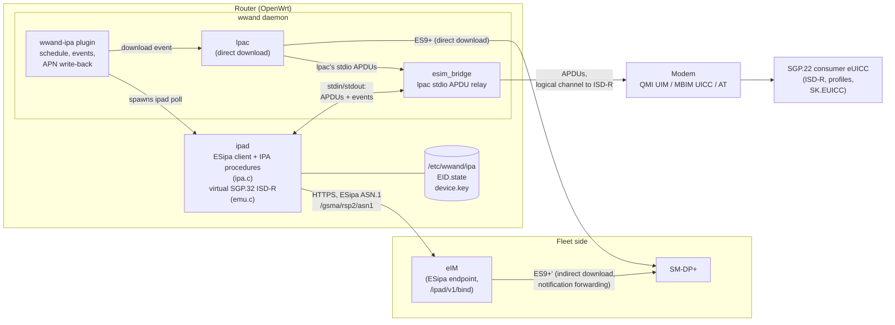
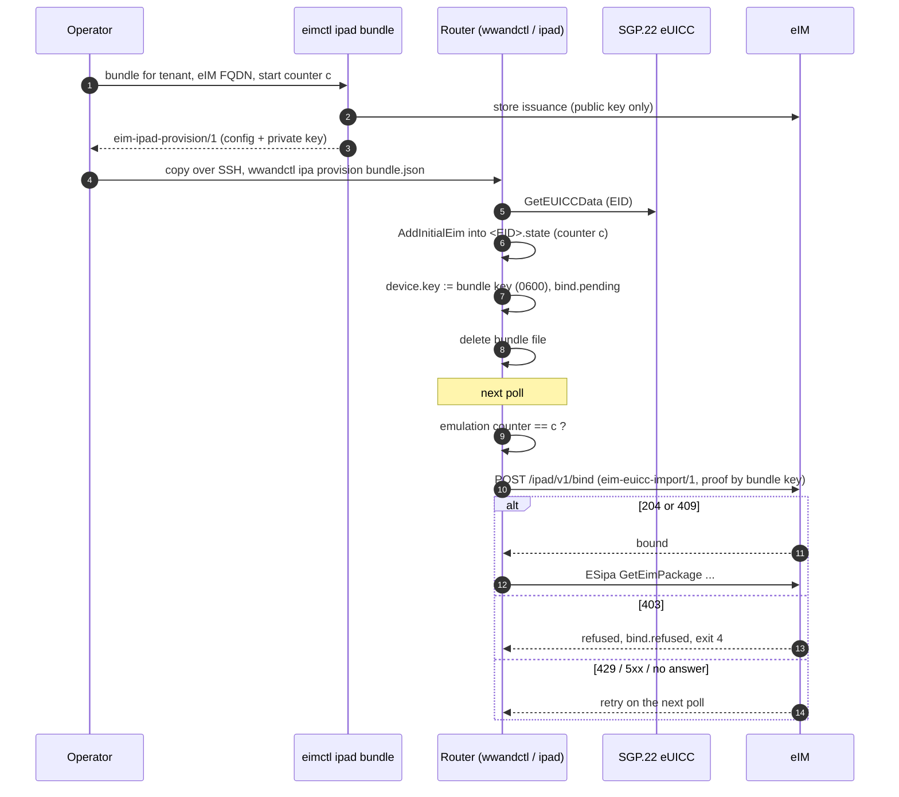
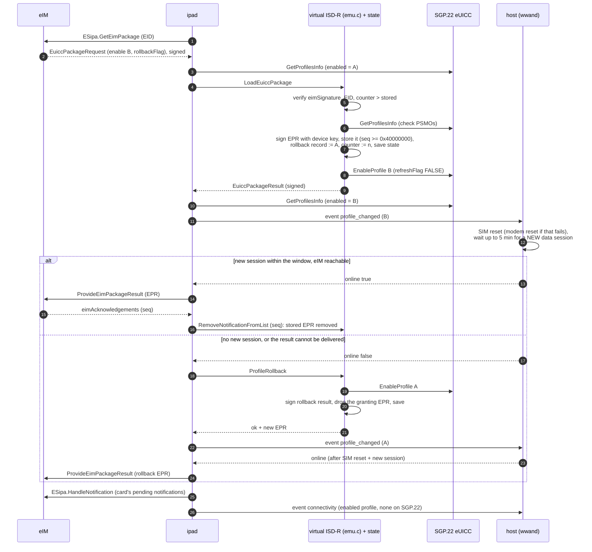
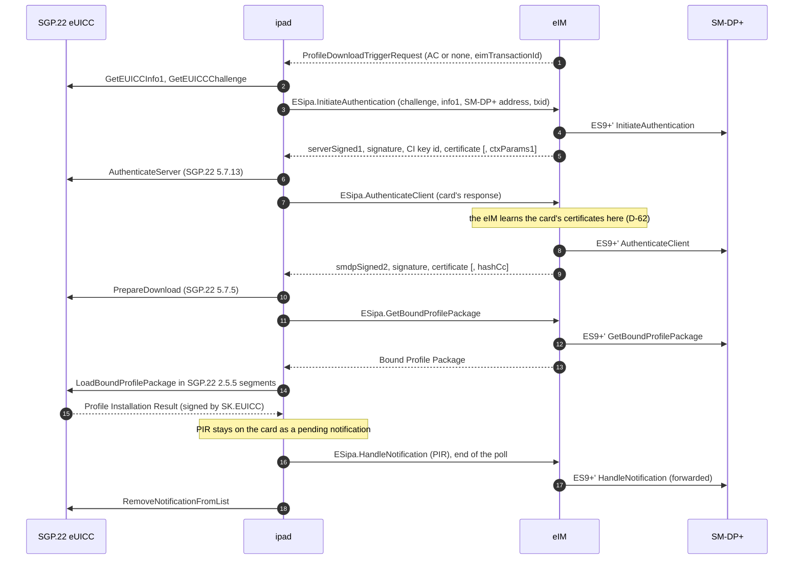
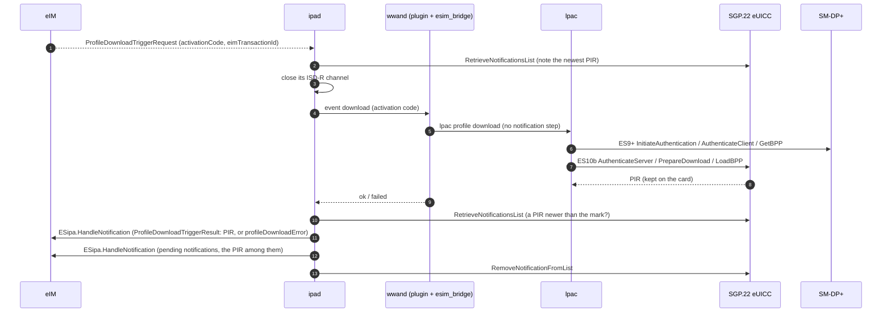

# SGP.32 on an SGP.22 consumer eUICC: how ipad emulates it

ipad is an SGP.32 v1.3 IoT Profile Assistant. On an **IoT eUICC** it has
little to do. The card holds the eIM configuration, checks the eIM's
signature and the replay counter, and signs its own results, so ipad only
carries messages between the eIM and the card.

An **ordinary SGP.22 consumer eUICC** (the kind lpac manages) has none of
that. It can download, enable, disable and delete profiles, but it knows
nothing about an eIM. ipad puts a *virtual SGP.32 ISD-R* in front of such a
card:

- ipad answers the ES10b functions that SGP.32 adds (`src/emu.c`);
- it passes every SGP.22 function to the card unchanged;
- it keeps, in a file per card, the state an IoT eUICC would keep internally;
- it signs results with a device key.

This page describes what the emulation does, where it keeps its state, how
the eIM comes to trust it, and what it cannot guarantee. Section numbers
refer to SGP.32 v1.3 unless SGP.22 (v2.7) is named. They were checked
against `spec/v13.txt` and `spec/v22-27.txt`. Where a code comment gives a
different number, the difference is listed under [Notes on the sources](#notes-on-the-sources).

- [Components](#components)
- [Which card ipad is talking to](#which-card-ipad-is-talking-to)
- [What an SGP.22 card lacks, and what ipad does instead](#what-an-sgp22-card-lacks-and-what-ipad-does-instead)
- [The state ipad keeps](#the-state-ipad-keeps)
- [Signing with the device key](#signing-with-the-device-key)
- [How the eIM learns the device key](#how-the-eim-learns-the-device-key)
- [SGP.32 → SGP.22 mapping](#sgp32--sgp22-mapping)
- [An eIM package run, step by step](#an-eim-package-run-step-by-step)
- [Profile downloads](#profile-downloads)
- [Notifications and Profile Installation Results](#notifications-and-profile-installation-results)
- [Trust: the card versus ipad's state](#trust-the-card-versus-ipads-state)
- [Notes on the sources](#notes-on-the-sources)

## Components

ipad never opens the modem. It reaches the card through a host process over
stdin/stdout, using lpac's stdio APDU protocol plus a few events that only
the host can handle (`src/host.h`). Under wwand the host is `esim_bridge`,
which relays the APDUs over the modem's own channel (QMI UIM, MBIM UICC or
AT) as it does for lpac.



`euicc.c` puts one call, `euicc_es10()`, in front of both card types. The
IPA procedures in `ipa.c` are written once against that call, and they do not
know whether the card behind it is real or emulated.

## Which card ipad is talking to

`euicc_probe()` sends `ES10b.GetEimConfigurationData` (tag `BF55`, 5.9.18).
An IoT eUICC answers with `BF55`, possibly with an empty list. An SGP.22 card
does not know the function: it rejects it with a status word, or it answers
with something other than `BF55`. `-b iot` or `-b emu` skips the probe, and
under wwand `option ipa_backend 'iot'|'emu'` does the same.

`ipad info` shows the result as `backend` (`iot` or `emulated`), and
`wwandctl ipa` shows it as "SGP.22 card, emulated" or "IoT eUICC".

## What an SGP.22 card lacks, and what ipad does instead

| SGP.32 function | On an IoT eUICC | What ipad does for an SGP.22 card |
|---|---|---|
| eIM configuration (2.11.1.1.1, AddInitialEim 5.9.4, GetEimConfigurationData 5.9.18) | on the card | Kept in the state file, up to 8 eIMs. `AddInitialEim` is refused (`associatedEimAlreadyExists`) once one is stored. The associationToken is generated by a counter in the state (`token_ctr`). |
| Verifying the eIM's signature on an eUICC Package (5.9.1) | on the card | ipad verifies `eimSignature` with `eimPublicKey` or the key in `eimCertificate` from the stored configuration. The signed input is the `euiccPackageSigned` data object as received, followed by the associationToken data object (`84 01 00` when no token is configured, 2.11). |
| EID check and replay counter (5.9.1) | on the card | Wrong EID: signed error `invalidEid` (3). Counter not above the stored one: signed error `replayError` (4). Otherwise the counter moves with the package. |
| Signed eUICC Package Result / Error (2.11.2.1) | signed with SK.EUICC.ECDSA | Signed with the **device key**, over the same bytes. |
| Stored eUICC Package Results until acknowledged (2.11.2) | on the card | Up to 16 kept in the state file, each with a sequence number starting at `0x40000000` (`EMU_SEQ_BASE`), well above the card's own notification numbers. When the store is full the oldest is dropped. `RemoveNotificationFromList` with a number at or above that base removes the stored result, and a lower number goes to the card. |
| Profile Rollback (3.3.2, 5.9.16) | on the card | An `enable` with `rollbackFlag` records the previously enabled profile. The next package clears the record. `ProfileRollback` enables the old profile again, signs a new result (`rollbackResult ok`) and discards the result of the package that granted the rollback. |
| Fallback attribute and mechanism (3.4.6, 3.4.7, 5.9.20, 5.9.21) | on the card | The attribute and the "fallback active / previous profile" record are kept in the state. `GetProfilesInfo` adds `fallbackAttribute` (`9F26`) to that profile. See the note below on `fallbackAllowed`. |
| Immediate Profile Enabling (3.4.4, 3.4.5, 5.9.15, 5.9.17) | on the card | The flag, the SM-DP+ OID and the address are kept in the state. A completed download is noticed in the Profile Installation Result that passes through, and `ImmediateEnable` enables that ICCID. |
| eUICCMemoryReset, SGP.32 bits (5.9.5) | on the card | The SGP.22 reset options go to the card (`ES10c.eUICCMemoryReset`). `resetEimConfigData` and `resetImmediateEnableConfig` clear ipad's state. |
| GetCerts (5.9.10) | on the card | Answered with an error: an SGP.22 card has no such function. |
| GetConnectivityParameters (5.9.24) | on the card | `parametersNotAvailable`: an SGP.22 profile carries no connectivity parameters. |
| Enable/DisableEmergencyProfile (5.9.22, 5.9.23) | on the card | `ecallNotAvailable`. |

`emu.h` states the rule: ipad reports as unavailable anything an SGP.22 card
cannot provide, and never fakes it.

**`fallbackAllowed`.** SGP.32 3.4.6 allows the fallback attribute only on a
profile whose metadata carries `fallbackAllowed` (`9F67`). SGP.22 v2.7 only
reserves that tag for SGP.32, so an SGP.22 card normally does not report it.
`setFallbackAttribute` then answers `fallbackNotAllowed` (2), unless ipad runs
with `-F` ("every profile may be the fallback", explicitly *not* SGP.32).
wwand-ipa never passes `-F`.

**Nobody triggers the fallback mechanism.** ipad's own procedures never call
`ExecuteFallbackMechanism` or `ReturnFromFallback`. The emulation answers them
when something calls them, but neither `ipa.c` nor the wwand plugin does.
SGP.32 (2.11.1.1.3, the NOTE on the Fallback Mechanism) leaves the detection
of a "permanent loss of connectivity" to the device. `-C <cause>` puts a
`notifyStateChange` with a cause into the next `GetEimPackage`, but wwand-ipa
does not pass it either. The same applies to `ImmediateEnable`: the emulation
supports it, and the IPA procedures do not call it.

## The state ipad keeps

Everything lives in the state directory, `-s <dir>` (default and under wwand:
`/etc/wwand/ipa`). ipad creates the directory itself, with mode 0700 on the
last component. The wwand-ipa package keeps it across a sysupgrade
(`/lib/upgrade/keep.d/wwand-ipa`).

| File | What | Written |
|---|---|---|
| `device.key` | The device key: P-256, SEC1 `ECPrivateKey` DER. **One key per state directory**, i.e. one per router under wwand, shared by all its cards. | Created the first time an emulated card is opened (`device_key()`), or replaced by a bundle (`provision`). Written under a unique temporary name with mode 0600, then renamed. It is created under a `flock` of the directory, so two first runs cannot end up with two keys. |
| `<EID>.state` | The emulation's state for one card (32-digit EID in the name). | After every function that changes it: written to `<file>.tmp` with `fsync`, then renamed, so a crash leaves either the old state or the new one. |
| `bind.pending`, `bind.done`, `bind.refused`, `bind.after` | Where the self-binding of a bundle stands (see [below](#b-a-provisioning-bundle-eim-decision-d-69)). | By `provision` and `poll`. |

The state file is DER (`emu_state.c`):

```
State ::= SEQUENCE {
  eid        [0]  OCTET STRING (16),
  eims       [1]  SEQUENCE OF SEQUENCE { cfg EimConfigurationData,
                                         counter [1] INTEGER,
                                         token   [2] INTEGER OPTIONAL },
  seq        [3]  INTEGER,                      -- last result sequence number used
  eprs       [4]  SEQUENCE OF SEQUENCE { seq [0] INTEGER, epr EuiccPackageResult },
  rollback   [5]  SEQUENCE { iccid 5A, eimId [0], counter [1],
                             txid [2] OPTIONAL, eprSeq [3] } OPTIONAL,
  fallback   [6]  SEQUENCE { iccid 5A, active [1] BOOLEAN,
                             prev [2] OCTET STRING OPTIONAL } OPTIONAL,
  immediate  [7]  SEQUENCE { flag [0] BOOLEAN, oid [1] OPTIONAL,
                             addr [2] OPTIONAL } OPTIONAL,
  tokenCtr   [8]  INTEGER
}
```

The state is bound to the card. `emu_open()` reads the EID from the card
(`GetEUICCData`, tag list `5A`) and refuses a state file whose `eid` does not
match. The run then fails with "emulation state unusable (written for another
card?)" rather than reusing the file.

**Order matters for the replay counter.** In `LoadEuiccPackage` the counter
and the signed result are saved *before* the card is switched. The other
order would let a crash between the two leave the counter behind, and the
same package would then run a second time. This comes at a cost, and the code
names it: a crash after the save and before the switch leaves a signed "ok"
for a change the card never made. The eIM sees the real state in the next
profile list. An IoT eUICC cannot get into this state, because 5.9.1 makes
the whole function atomic.

**What is lost with what.**

| Lost | Effect | Way back |
|---|---|---|
| `device.key` only | If the file is **gone**, the next run creates a new key, and the eIM rejects results signed with it until it is imported. If the file **exists but cannot be read**, it is never replaced: the run fails with "device key … unreadable; not replacing it". | Export a new import file and re-key on the eIM. See "A lost device key" in the [README](../README.md#a-lost-device-key) and the counter rule [below](#re-keying). |
| `<EID>.state` only | Without state the card has no eIM: `poll` exits 3 ("no eIM configured"). If a configuration file is at hand, it is provisioned again, and the counter restarts from **that file's** `counterValue`. Stored results, the rollback record, the fallback and immediate-enable settings and the associationToken counter are gone. | Provision a configuration whose counter starts at the eIM's current counter (or above it). Packages the device already ran would otherwise be accepted again: they are signed, and a counter below them no longer stops them. |
| Both | As above, plus a new key. | `ipad reset`, a fresh bundle or configuration, re-key on the eIM. |

`ipad reset` (and `wwandctl ipa reset`) deletes `device.key`, **every**
`*.state` in the directory and the `bind.*` markers. No card is needed for it.
Under wwand the directory is shared by all modems, so the reset applies to
every card on the router.

## Signing with the device key

An IoT eUICC signs `euiccSignEPR` and `euiccSignEPE` with SK.EUICC.ECDSA.
The emulation signs **the same input** with the device key (`sign_epr`,
`sign_epe` in `emu.c`):

- result: `DER(euiccPackageResultDataSigned) || associationToken DO`
  (2.11.2.1), where the data carries eimId, counterValue, eimTransactionId
  (if any), seqNumber and the results;
- error: `DER(euiccPackageErrorDataSigned) || associationToken DO`, used for
  `invalidEid` and `replayError`.

The signature is ECDSA-SHA256 over P-256 in the plain `r‖s` form (64 octets),
the same form SGP.22 and the eIM use (`crypto.h`).

A package from an eIM ipad does not know, or whose signature does not verify,
gets an `EuiccPackageErrorUnsigned`. Nothing is signed for a sender that could
not be authenticated.

The device key signs **only** the eUICC Package Results and Errors. Profile
Installation Results and the enable/disable/delete notifications are still
signed by the card itself with SK.EUICC, as SGP.22 prescribes (SGP.22 2.5.6).
The eIM verifies those against the card's own certificates (see [Trust](#trust-the-card-versus-ipads-state)).

## How the eIM learns the device key

The eIM has to connect the key to the card before it verifies anything. There
are two ways to do that, and both carry the same file: `eim-euicc-import/1`.

### The import file

`ipad export <file>` (or `wwandctl ipa [modem] export <file>`) writes one
JSON object (`build_import()` in `main.c`):

| Field | Content |
|---|---|
| `format` | `eim-euicc-import/1` |
| `eid` | the card's EID |
| `emulated` | `true` |
| `ipa_public_key` | base64 DER SubjectPublicKeyInfo of the device key |
| `counter` | the replay counter the emulation holds for the eIM (the one named with `-e`, else the first) |
| `association_token` | when that eIM has one |
| `euicc_info1` | the card's `GetEUICCInfo1` (`BF20`), base64, when it answers |
| `ipa_capabilities` | base64 `IpaCapabilities` (4.1): indirect download always, direct download with `-D` |
| `device.imei` | with `-i` |
| `proof` | the device key's signature (base64 `r‖s`) over `"eim-euicc-import/1\n" + eid + "\n" + ipa_public_key + "\n" + counter + "\n"` |

The proof signs the base64 **text** of the key, as it appears in the file, so
both sides sign the same bytes (eIM decision D-62). `export` works only for
an emulated card. An IoT eUICC signs with its own certificate and has no use
for the file.

### a) Import by the operator (eIM decision D-62)

```
wwandctl ipa [modem] export /tmp/device.json    # on the router
eimctl euicc import device.json                 # on the eIM
```

The eIM checks the format, the EID's check digits, that the key is P-256 and
the proof, and registers the card as emulated with that key. From then on it
verifies every result against the key. The eIM learns the card's own
certificates (CERT.EUICC, CERT.EUM) during the first indirect download, from
the `AuthenticateServerResponse` it relays (eIM `flows/ipa-key-import.md`).
It needs them to verify PIRs and notifications, and it refuses a direct
download for such a card until it has them.

### b) A provisioning bundle (eIM decision D-69)

The eIM can issue the device key itself, before the card's EID is known:
`eimctl ipad bundle` writes an `eim-ipad-provision/1` file. It holds the eIM
configuration and an **unencrypted** PKCS#8 private key, a start counter and
an expiry. `ipad provision <bundle>` does the following:

1. reads the bundle strictly (`bundle.c`): one flat JSON object, string and
   integer values without escapes, each field once, nothing after it, at most
   16 KiB. It refuses anything else, as well as an expired bundle (when the
   clock is set) and a key that is not a consistent P-256 key;
2. stores the configuration through `AddInitialEim`, **first**. That is the
   step the card can refuse, and a refused bundle must not leave a new key
   behind;
3. for an emulated card, replaces `device.key` with the bundle's key (0600)
   and writes `bind.pending` (issuance id, start counter). The markers of an
   earlier binding are removed;
4. deletes the bundle file. A bundle that could not be stored is left in
   place, because it holds the key: delete it or retry.

The next `poll` **binds** the card before it asks for packages. It sends the
card's import file, signed with the bundle key, to
`https://<eIM host>[:port]/ipad/v1/bind`, over the same TLS as ESipa. ipad
sends the binding only while the emulation's counter still equals the bundle's
start counter (the eIM requires this). If the counter has moved, ipad logs
"not binding: the emulation's counter … is not the bundle's …" and keeps the
binding pending.

| eIM answer | ipad (`bind_outcome_of`) |
|---|---|
| 204, or 409 (EID already registered) | bound: `bind.done`, and the poll continues |
| 403 | refused: `bind.refused`. `poll` exits 4 and stops polling this card until an operator acts (a new bundle, or `ipad reset`) |
| 429 | retry on the next poll. A `Retry-After` in seconds, at most a day, is honoured: until then `poll` does not contact the eIM and ends as a retry (`binding deferred`) |
| 5xx, no answer | retry on the next poll |
| 400, 413, anything else | reported as an error. The binding stays pending |

An IoT eUICC takes only the configuration from a bundle. It signs with its
own certificate, so ipad neither uses the key nor binds.



### Re-keying

The eIM refuses a second import of a card unless it is told to replace the
key (`eimctl euicc import --replace-key`). Since eIM decision D-68 it then
also requires the file's counter to be **strictly above** the counter the eIM
holds for the card, and a key that differs from the stored one. Otherwise it
answers with the minimum counter to initialise the device with. The eIM
enforces this in `eim-store` `replace_ipa_key` (`counter <= stored` is
refused). A replayed old import file therefore cannot reinstate its key, and
a device restarted below the eIM's counter could not accept old packages
again.

`export` writes the counter the emulation holds, and that is at most the
eIM's. A re-key therefore needs an emulation whose counter was started
**above** the eIM's:

1. read the eIM's counter: `eimctl euicc show <EID>`;
2. `ipad reset`, which removes the key, the state and the binding, and with
   them the stored results and the rollback record;
3. write a configuration that starts above it:
   `eimctl eim-config cfg.der --fqdn … --counter <eIM counter + 1>`;
4. `ipad provision cfg.der`, then `ipad export device.json`;
5. `eimctl euicc import device.json --replace-key`.

The README's "A lost device key" section says "not below" and describes a
re-key with the state kept. Measured against the eIM's current code, that
path is refused. See [Notes on the sources](#notes-on-the-sources).

## SGP.32 → SGP.22 mapping

How each SGP.32 operation is carried out on an SGP.22 card. "State" means the
`<EID>.state` file. The ES10c functions are SGP.22's names (in SGP.32 they
sit under ES10b).

| SGP.32 operation | SGP.22 calls on the card | ipad state involved |
|---|---|---|
| **ES10b.LoadEuiccPackage** (5.9.1): check signature, EID, counter; run the list; sign; persist; apply | `ES10c.GetProfilesInfo` (`BF2D`, SGP.22 5.7.15) once, to check the PSMOs against the card's profile states; then the marks below, **after** signing and saving (3.3.1 step 8b) | eIM record (key, counter, token), result store, rollback record |
| PSMO `enable` (3.4.1) | `ES10c.EnableProfile` (`BF31`, SGP.22 5.7.16), `refreshFlag` FALSE. SGP.22 disables the enabled profile itself | clears the fallback reference; with `rollbackFlag`, records the previous profile (`rollbackNotAvailable` if none is enabled) |
| PSMO `disable` (3.4.2) | `ES10c.DisableProfile` (`BF32`, SGP.22 5.7.17), `refreshFlag` FALSE, only when nothing is enabled in the same package | none |
| PSMO `delete` (3.4.3) | `ES10c.DeleteProfile` (`BF33`, SGP.22 5.7.18), up to 8 per package | refused for the rollback target (`rollbackNotAvailable`) and for the profile to return to from fallback (`returnFallbackProfile`) |
| PSMO `listProfileInfo` | `ES10c.GetProfilesInfo` passed through, the card's `BF2D` as the result | none |
| PSMO `getRAT` | `ES10b.GetRAT` (`BF43`, SGP.22 5.7.22) | none |
| PSMO `configureImmediateEnable` (3.4.4) | none | immediate-enable flag, OID, address |
| PSMO `setFallbackAttribute` / `unsetFallbackAttribute` (3.4.6, 3.4.7) | `GetProfilesInfo` (for the check) | fallback record |
| PSMO `setDefaultDpAddress` (5.9.25) | `ES10a.SetDefaultDpAddress` (`BF3F`, SGP.22 5.7.4) | none |
| eCO `addEim`, `updateEim`, `deleteEim`, `listEim` (3.5.1) | none | eIM records (a deleted eIM is removed after the result is signed, because it may be the requester) |
| **ES10b.AddInitialEim** (5.9.4, 3.5.2.1) | none | eIM records; refused once any eIM is stored |
| **ES10b.GetEimConfigurationData** (5.9.18) | none | eIM records, rendered without `counterValue` and with the generated associationToken |
| **ES10b.ProfileRollback** (5.9.16) | `ES10c.EnableProfile` of the recorded profile | rollback record; a new signed result replaces the granting one |
| **ES10b.ExecuteFallbackMechanism** (5.9.20) / **ReturnFromFallback** (5.9.21) | `ES10c.EnableProfile` of the fallback / previous profile | fallback record (active, previous profile) |
| **ES10b.ImmediateEnable** (5.9.15) | `ES10c.EnableProfile` of the profile just installed | flag in the state; the "download just completed" context exists only in memory, for this run |
| **ES10b.ConfigureImmediateProfileEnabling** (5.9.17) | none | immediate-enable settings; refused while an eIM is configured |
| **ES10b.RetrieveNotificationsList** (5.9.11) | passed to the card (`BF2B`, SGP.22 5.7.10), except a request for eUICC Package Results or for a sequence number from `0x40000000` up | result store |
| **ES10b.RemoveNotificationFromList** (5.9.12) | passed to the card (SGP.22 5.7.11) below `0x40000000` | result store at or above it |
| **ES10b.GetProfilesInfo** (5.9.14) | passed to the card | adds `fallbackAttribute` to the fallback profile |
| **ES10b.eUICCMemoryReset** (5.9.5) | `ES10c.eUICCMemoryReset` (`BF34`, SGP.22 5.7.19) for the SGP.22 options | eIM records and immediate-enable settings for the SGP.32 bits |
| GetCerts (5.9.10), GetConnectivityParameters (5.9.24), emergency profile (5.9.22/23) | none | none: answered as not available |
| **Indirect download** (3.2.3.2): GetEUICCInfo, GetEUICCChallenge, AuthenticateServer, PrepareDownload, LoadBoundProfilePackage, CancelSession | passed to the card unchanged (SGP.22 5.7.5–5.7.14). BPP segments go to the card as they are | a successful PIR opens the immediate-enable context |
| **Direct download** (3.2.3.1) | lpac runs SGP.22 ES9+ and ES10b against the card itself | none |

## An eIM package run, step by step

`ipad poll` loops `ESipa.GetEimPackage` (5.14.5), for up to 16 packages per
run, until the eIM answers `noEimPackageAvailable`. Then it delivers the
pending notifications. For each eUICC Package (`handle_package()` in `ipa.c`):

1. read the enabled ICCID;
2. `LoadEuiccPackage` (emulated: verify, run, sign, persist, switch);
3. read the enabled ICCID again. If it changed, send the host the event
   `profile_changed` and wait for its answer. Under wwand, that means a SIM
   reset and a wait of up to 5 minutes for a *new* data session;
4. if the host says online, send `ESipa.ProvideEimPackageResult` (5.14.6), and
   remove the results the eIM acknowledges (`eimAcknowledgements`);
5. if the profile changed and the result **could not be delivered** (the host
   said offline, *or* the eIM could not be reached over the new profile), call
   `ProfileRollback` (`refreshFlag` FALSE). If it answers ok, tell the host
   `profile_changed` for the old ICCID and deliver the rollback's result
   **instead** (3.3.2 NOTE1). If it is refused (no `rollbackFlag` in the
   enable), the result stays stored on the card or in the emulation, and the
   eIM can fetch it later with an `IpaEuiccDataRequest`.



The signed result is built from checks against the card's profile list taken
*before* any switch. `apply_marks()` does not look at the card's own answer
to the later `EnableProfile`, `DisableProfile` or `DeleteProfile`. A switch
the card refuses at that point still shows as ok in the signed result. The
next `listProfileInfo` gives the eIM the real state.

## Profile downloads

An eIM asks for a download with a `ProfileDownloadTriggerRequest` (2.11.1.3).
ipad takes the direct path when two things hold: the trigger carries an
activation code, and the host offers direct download (`-D`, which wwand-ipa
passes unless `option ipa_direct '0'`). Otherwise, including triggers with
`contactDefaultSmdp` or `contactSmds`, it downloads indirectly through the eIM.
`IpaCapabilities` tells the eIM which paths are available.

### Indirect download (3.2.3.2)

ipad runs the SGP.22 download through the eIM, which relays ES9+ to the
SM-DP+. The card is used exactly as in a consumer download. Every ES10 call
goes to it unchanged, and the emulation only watches the result go by.



If a step fails after the eIM has handed out a TransactionID, ipad calls
`ES10b.CancelSession` on the card and `ESipa.CancelSession` (3.2.3.3). The
reason is `pprNotAllowed`, `metadataMismatch`, `loadBppExecutionError` or
undefined, depending on the step. A failed indirect download is also reported
to the eIM as a `ProfileDownloadTriggerResult` with `profileDownloadError`.

### Direct download (3.2.3.1)

ipad cannot speak ES9+ to an SM-DP+ itself. It sends the host the event
`download` with the activation code, and waits. Before that it closes its own
logical channel, because lpac needs the card while ipad waits.



The download runs under ipad's own claim on the card (`esim_bridge
session_download`), so no other lpac operation can get in between. wwand
runs lpac **without** its notification step. That leaves the PIR on the card
for ipad to report.

## Notifications and Profile Installation Results

What the code does:

- `ipa_deliver_notifications()` runs at the end of every successful poll, and
  `ipad notify` runs it on its own. It retrieves the card's pending
  notifications (PIRs and `OtherSignedNotification`s, signed by the card) and
  sends each one to the eIM with `ESipa.HandleNotification` (5.14.7, 3.7 option
  [2b]). A notification is removed from the card (`RemoveNotificationFromList`)
  only after the eIM answers 204 or 200. At the first failure the rest are kept
  for the next run.
- ipad **never** sends a notification to an SM-DP+ over ES9+ itself. Delivery to
  the Notification Receiver is the eIM's job (3.7 [2b]: the eIM forwards over
  ES9+').
- eUICC Package Results do not go through this path. They are delivered with
  `ProvideEimPackageResult` right after the package ran, and removed when the
  eIM acknowledges their sequence number.
- The emulation does not discard the card's notifications after a rollback.
  3.3.2 NOTE2 allows that as an optimisation, but does not require it. The
  enable notifications of both switches are delivered.

**Direct downloads and the SM-DP+.** In a direct download the PIR reaches the
eIM twice: inside the `ProfileDownloadTriggerResult`, and later as a pending
notification. It never reaches the SM-DP+ from the device. The eIM
documentation (`docs/architecture/flows/direct-download.md` and
`notification-forwarding.md`, as of 2026-09-26) describes how the eIM handles
each of the two:

- the trigger result completes the operation;
- a PIR that arrives alone via `HandleNotification`, without an RSP session
  and without an EID in the call, is not forwarded ("the IPA must use ES9+
  itself").

Read together, the SM-DP+ may not learn of a direct download's installation
through this combination. This is recorded as an open point. Indirect
downloads, the default on the eIM (D-50), are not affected: their PIR belongs
to a session the eIM knows and is forwarded.

**No-confirm test downloads.** The eIM has a lab-only deviation, decision
D-72. For SM-DP+s the eIM operator has put on an explicit allowlist
(`EIM_NO_CONFIRM_SMDP`, for lab and test servers whose operators consent), the
eIM acknowledges a no-confirm download's PIR and the profile's later
notifications but does not forward them. This is entirely an eIM function:
ipad behaves exactly as above and has no switch, no allowlist and no
notification hold of its own.

## Trust: the card versus ipad's state

With an IoT eUICC, the eIM's authority is enforced inside the card. With an
SGP.22 card, part of it is enforced by ipad's software and files on the
router. The eIM's own verdict (D-62): "the device key vouches for the IPA,
not the card – a genuine IoT eUICC stays stronger."

| Property | IoT eUICC | SGP.22 card + ipad |
|---|---|---|
| Profile contents, keys (Ki, OTA keys), BPP decryption | card | card (unchanged) |
| Mutual authentication with the SM-DP+, BPP bound to this card | card | card (unchanged, SGP.22) |
| PIR and enable/disable/delete notifications are genuine | card (SK.EUICC) | card (SK.EUICC), verified by the eIM against the card's certificate chain |
| Only the configured eIM may change profiles | card verifies `eimSignature` | **ipad** verifies it, in software |
| An old package cannot be replayed | card's counter | **counter in `<EID>.state`** |
| A result is genuine and belongs to this package | card signs (SK.EUICC) | **device key** in `/etc/wwand/ipa/device.key` |
| Rollback, fallback, immediate-enable records | card | **state file** |
| Local profile changes by other software | whatever the card's SGP.32 implementation allows (not examined here) | **not restricted by the card**: SGP.22's ES10c is open to any local LPA. wwand refuses manual changes while the plugin manages the card (`esim_managed`), but `force` overrides it, and root can run lpac directly |

**What root on the router can do** with an emulated card:

- read `device.key` and sign arbitrary eUICC Package Results. The eIM would
  accept results for packages that never ran, or results that differ from
  what ran;
- edit or replace `<EID>.state`: lower the counter so that old, signed
  packages are accepted again, or add an eIM configuration of its own choice,
  which ipad would then obey;
- enable, disable or delete profiles directly with lpac, bypassing eIM and
  ipad;
- hold back or delay results and notifications (possible with an IoT eUICC as
  well: the IPA always carries them);
- before its first contact with the eIM, use a bundle's key to bind **any**
  unregistered EID under the bundle's tenant. The eIM documents this
  residual risk in its `security.md` ("the key holder is structurally the
  customer").

**What root cannot do**, because the card still enforces it:

- read profile secrets out of the card, or install a profile that was not
  bound to this card by the SM-DP+;
- forge a PIR or a notification: they carry the card's SK.EUICC signature,
  which the eIM checks against the card's certificate chain;
- make the eIM accept results for this card without a key the eIM has
  registered: the eIM verifies against the imported or issued key, and a
  re-key needs an operator (`--replace-key`, counter strictly above the
  eIM's).

In short, an emulated card is as trustworthy as the router it sits in. It is
the right choice for a fleet of routers you control, and a genuine IoT eUICC
is the stronger choice where the device itself is not trusted.

## Notes on the sources

- **Section numbers in code comments.** Several comments give a number that
  differs from the SGP.32 v1.3 text in `spec/v13.txt` (identical in v1.2).
  This page uses the specification's numbers:
  - AddInitialEim is 5.9.4 (the comments in `emu.c` and `ipa.h` say 5.9.17);
  - ConfigureImmediateProfileEnabling is 5.9.17 (`emu.c` says 5.9.19);
  - ExecuteFallbackMechanism and ReturnFromFallback are 5.9.20 and 5.9.21
    (`emu.c` and `emu_int.h` say 5.9.21 and 5.9.22);
  - RetrieveNotificationsList is 5.9.11 (`emu.c` says 5.9.10; `ipa.c` has
    5.9.11);
  - eUICCMemoryReset is 5.9.5 (`emu.c` says 5.9.11);
  - ESipa.ProvideEimPackageResult is 5.14.6 (`ipa.c` says 5.14.3).
- **Re-key counter.** The README's "A lost device key" says the file's counter
  must be "not below" the eIM's. The eIM requires strictly above (D-68,
  `eim-store` `replace_ipa_key`). The procedure under
  [Re-keying](#re-keying) follows the eIM's code.
- **`ipad -h`** lists neither `reset` nor the bundle form of `provision`. Both
  exist (`main.c`).
- **Not verified on hardware:** the eIM docs and the wwand-ipa README both
  record that no run on router hardware with an eUICC has been made yet. Every
  flow here is verified against the code and the host-side tests
  (`tests/test_emu.c`, `tests/test_ipa.c`, `tests/test_cli.sh`,
  `tools/esipa-check.sh`, `tools/e2e-eim.sh`) only.
